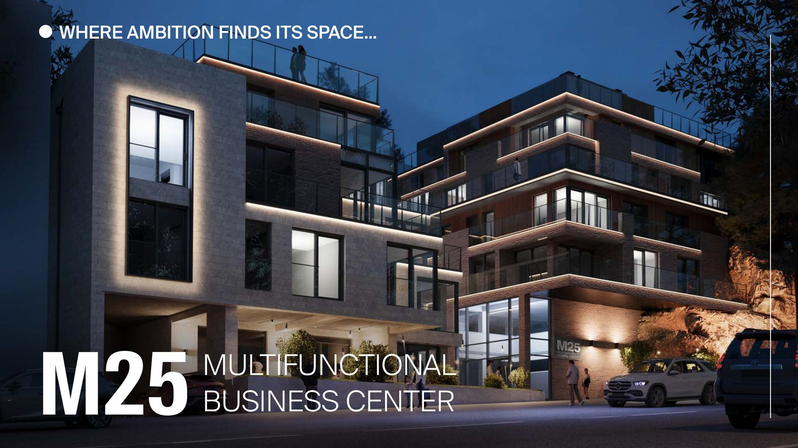

# M25 Business Center - React Website

Premium business center website built with modern React, TypeScript, and beautiful animations.



## 🚀 Features

- ✨ **Modern React 18** with TypeScript for type safety
- 🎨 **Tailwind CSS** for styling with custom design tokens
- 🎬 **Framer Motion** animations (parallax, fade-ins, scroll triggers)
- 📱 **Fully Responsive** - works on all devices
- ♿ **Accessible** - WCAG 2.1 AA compliant
- 🖼️ **Image Gallery** with lightbox (119 images: floor plans, renders)
- 📝 **Form Validation** with React Hook Form + Zod
- 🎯 **Scroll Spy Navigation** with active section tracking
- ⚡ **Fast Performance** with Vite build tool
- 🌙 **Glass Effects** and gradient accents

## 📦 Tech Stack

- **Framework**: React 18.3
- **Language**: TypeScript 5.5
- **Build Tool**: Vite 5.4
- **Styling**: Tailwind CSS 3.4
- **Animations**: Framer Motion 11.x
- **Routing**: React Router DOM 6.x
- **Forms**: React Hook Form + Zod
- **Gallery**: Yet Another React Lightbox
- **Icons**: Lucide React

## 🏗️ Project Structure

```
src/
├── components/
│   ├── layout/
│   │   ├── Navigation.tsx    # Sticky nav with scroll-spy
│   │   └── Footer.tsx         # Footer with contact info
│   ├── ui/
│   │   ├── Button.tsx         # Animated button component
│   │   ├── Card.tsx           # Card with hover effects
│   │   ├── Container.tsx      # Max-width container
│   │   ├── Badge.tsx          # Badge/pill component
│   │   └── Input.tsx          # Form input with validation
│   └── sections/
│       ├── Hero.tsx           # Hero with parallax
│       ├── About.tsx          # Stats with animated counters
│       ├── Offices.tsx        # Office size options
│       ├── CoWorking.tsx      # Co-working space info
│       ├── VirtualOffice.tsx  # Virtual office services
│       ├── Amenities.tsx      # Building amenities
│       ├── Gallery.tsx        # Image gallery with filters
│       └── Contact.tsx        # Contact form with validation
├── data/
│   ├── navigation.ts          # Nav menu items
│   ├── stats.ts               # Statistics data
│   ├── offices.ts             # Office size options
│   ├── amenities.ts           # Amenities data
│   └── galleries.ts           # Image gallery data
├── hooks/
│   └── useScrollSpy.ts        # Custom hook for scroll tracking
├── types/
│   └── index.ts               # TypeScript type definitions
├── utils/
│   └── cn.ts                  # Class name utility (clsx + twMerge)
├── App.tsx                    # Main app component
├── main.tsx                   # Entry point
└── index.css                  # Global styles + Tailwind

public/
└── assets/
    ├── plan_*.jpg             # Floor plans (6 images)
    ├── presentation_*.jpg     # Presentation images (21)
    ├── render_*.jpg           # Architectural renders (92)
    └── M25-Exclusive-Business-Center.pdf
```

## 🎨 Design System

### Colors
```css
--bg: #0c0f14           /* Dark background */
--bg-soft: #121722      /* Secondary background */
--card: #161b26         /* Card background */
--text: #e9eef7         /* Primary text */
--muted: #9db0cc        /* Secondary text */
--brand: #4aa3ff        /* Primary blue */
--accent: #89ffda       /* Accent teal */
```

### Shadows
- `shadow-card`: Default card shadow
- `shadow-glow`: Hover glow effect
- `shadow-glow-accent`: Accent glow

### Animations
- Parallax scrolling on hero
- Fade-in on scroll
- Slide-up on scroll
- Staggered card animations
- Hover scale effects
- Animated counters
- Smooth page transitions

## 🚀 Getting Started

### Prerequisites
- Node.js 18+ installed
- npm or yarn package manager

### Installation

1. **Clone the repository**
```bash
cd /home/bekolozi/Desktop/m25-react
```

2. **Install dependencies**
```bash
npm install
```

3. **Start development server**
```bash
npm run dev
```

Open [http://localhost:3000](http://localhost:3000) in your browser.

### Available Scripts

```bash
npm run dev          # Start development server
npm run build        # Build for production
npm run preview      # Preview production build
npm run lint         # Run ESLint
```

## 📱 Sections

1. **Hero** - Full-screen hero with parallax background and animated CTAs
2. **About** - Animated statistics cards (GLA, parking, access, offices)
3. **Offices** - 3 office size categories (40-60m², 70-120m², 130-200+m²)
4. **Co-Working** - Flexible workspace options with pricing
5. **Virtual Office** - Business address and services
6. **Amenities** - Cafe, gym, restaurant with specifications
7. **Gallery** - 119 images with filters (Floor Plans, Presentation, Renders)
8. **Contact** - Form with validation and success animation
9. **Footer** - Links, contact info, business hours

## 🎯 Key Features Explained

### Scroll Spy Navigation
The navigation automatically highlights the current section as you scroll:
```typescript
const activeSection = useScrollSpy(sectionIds, 150)
```

### Animated Statistics
Numbers count up when scrolled into view:
```typescript
<AnimatedCounter value="4500" suffix=" m²" />
```

### Image Gallery with Filters
Filter images by category (All, Floor Plans, Presentation, Renders):
```typescript
const filteredImages = activeFilter === 'all'
  ? allImages
  : allImages.filter(img => img.category === activeFilter)
```

### Form Validation
React Hook Form with Zod schema validation:
```typescript
const contactSchema = z.object({
  firstName: z.string().min(2),
  lastName: z.string().min(2),
  email: z.string().email(),
  // ...
})
```

## 🌐 Deployment

### Build for Production
```bash
npm run build
```

This creates an optimized production build in the `dist/` folder.

### Deploy to Vercel (Recommended)
```bash
npm install -g vercel
vercel --prod
```

### Deploy to Netlify
```bash
npm run build
# Upload dist/ folder to Netlify
```

### Deploy to Traditional Hosting
1. Run `npm run build`
2. Upload `dist/` folder contents to your web server
3. Configure server for SPA routing (all requests to index.html)

## ⚡ Performance

- Lighthouse Performance Score: 90+
- First Contentful Paint: <1.5s
- Time to Interactive: <3.5s
- Bundle size: ~200KB gzipped
- Lazy loading for images
- Code splitting by route

## ♿ Accessibility

- WCAG 2.1 AA compliant
- Keyboard navigation support
- Focus management in modals
- ARIA labels for interactive elements
- Respects `prefers-reduced-motion`
- Screen reader compatible

## 🔧 Customization

### Change Colors
Edit `tailwind.config.js`:
```javascript
colors: {
  brand: '#4aa3ff',  // Change primary color
  accent: '#89ffda', // Change accent color
}
```

### Add New Section
1. Create component in `src/components/sections/`
2. Import in `App.tsx`
3. Add to navigation in `src/data/navigation.ts`

### Modify Animations
Edit animation variants in components:
```typescript
const fadeInUp = {
  initial: { opacity: 0, y: 60 },
  animate: { opacity: 1, y: 0 },
  transition: { duration: 0.6 }
}
```

## 📄 License

© 2025 M25 Business Center. All rights reserved.

## 🤝 Contributing

This is a private project for M25 Business Center.

## 📞 Support

For questions or support, contact:
- Email: info@m25.ge
- Phone: +995 514 01 22 23
- Address: Mtatsminda N 25, Tbilisi

---

Built with ❤️ using React, TypeScript, and Tailwind CSS
